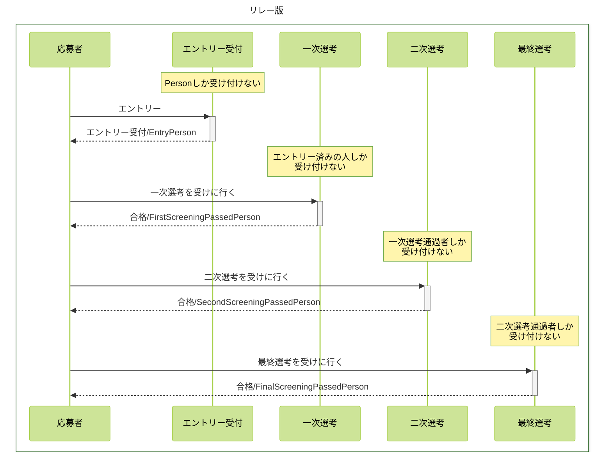
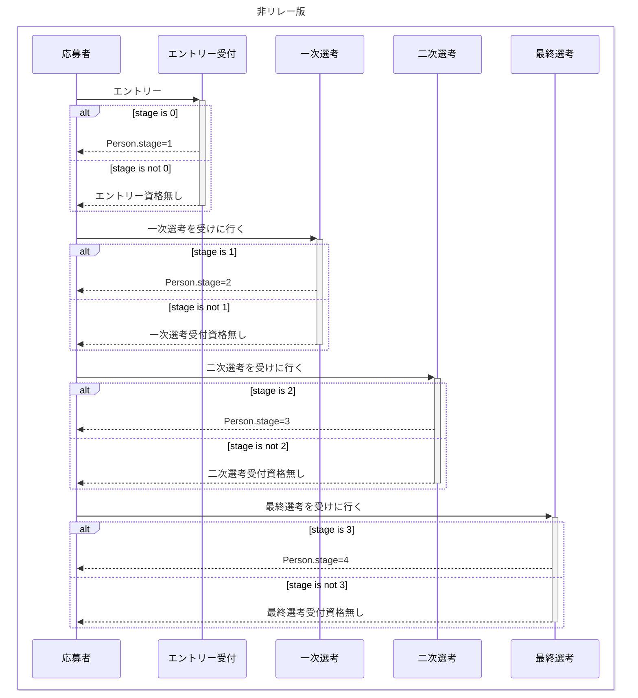

```bash
git init
npm install -g pnpm
pnpm add typescript @types/node ts-node nodemon @tsconfig/node22
pnpm tsc --init --rootDir src --outDir lib --esModuleInterop --resolveJsonModule --lib es6,dom  --module commonjs
pnpm add ts-pattern
```




